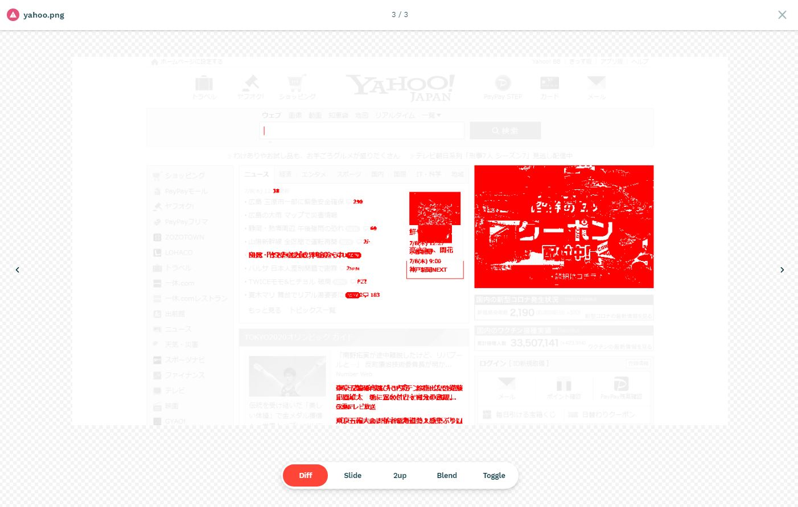

# 「ブラウザのスクリーンショット画像の比較による自動テスト」のサンプル

## 目的

ブラウザを利用してのスクリーンショット比較による自動テスト（VRT[Visual Regression Test]=画像回帰テスト） のやり方や例はネット上にもいくつも見つかるかと思います。  

ただ、それらの情報は、Vue.js やら React などの開発フレームワークとセットで利用した具体例が多く、そうしたフレームワークを使っていなかったり、開発言語に依存せずに、スクリーンショット比較テストだけをやりたいような場合には、やはり自分でゴリゴリと調べたり作ったりしないといけません。

開発言語に依存せずに独立したプロジェクトとしての自動テストのサンプル、ということを目的としてこのプロジェクトを作成しました。

本ソース内でテスト対象はYahoo!やGoogleのトップページなどを利用しています。これらを変更し、自分なりのテストコードを追加していくことで、流用していただければと思います。

## 利用技術

- NodeJS
  - 開発言語として利用
- Jest
  - テストフレームワーク
- Playwright
  - E2Eテストのフレームワーク
- reg-cli
  - 生成した画像を比較したりレポート出力したり

## インストール

```
$ git clone https://github.com/masum/vrtsample.git
$ cd vrtsample
$ npm i
```

## テストコードの場所

vrtsample/test/spec/test.spec.js にテストコードが書かれています。  
JestやPlaywrightの知識は必要にはなりますが、このフォルダにテストを追加します。

サンプルでは、以下の３つのページを読み込んでスクリーンショットを採取するだけのテストが書かれています。

```
  it("1", async () => {
    await page.goto("http://www.yahoo.co.jp/");
    await util.screenshot("yahoo");
  });

  it("2", async () => {
    await page.goto("http://www.google.co.jp/");
    await util.screenshot("google");
  });

  it("3", async () => {
    await page.goto("https://weather.yahoo.co.jp/weather/zoomradar/");
    await util.screenshot("weather");
  });
```


## マスター画像のとり方

```
$ npm run screenshot:master
```

jestによるテスト(vrtsample/test/spec配下)が実行され、スクリーンショットが vrtsample/output/screenshot/ja/master に保存されます。  
目視で正しさを確認します。  
機能追加や仕様変更等があった場合にだけマスターを採取し直します。  

マスターのディレクトリ( vrtsample/output/screenshot/ja/master )はindex of指定等によりブラウザから閲覧できるようにしておくと便利かと思います。

## テスト画像＆Diffのとり方

```
$ npm run screenshot:test
```
jestによるテスト(vrtsample/test/spec配下)が実行され、スクリーンショットが vrtsample/output/screenshot/ja/{YYYY-MM-DD}/img に保存されます。  
  
すべてのテスト終了後にマスターのフォルダとの比較を行います。  
比較した結果のDiff画像は vrtsample/output/screenshot/ja/{YYYY-MM-DD}/diff に保存され、 レポート(HTML形式)が vrtsample/output/screenshot/ja/{YYYY-MM-DD}/index.html に作成されます。  

## 結果レポート

画像の比較およびレポート作成は [reg-cli](https://github.com/reg-viz/reg-cli) を利用しています。  

表示例

